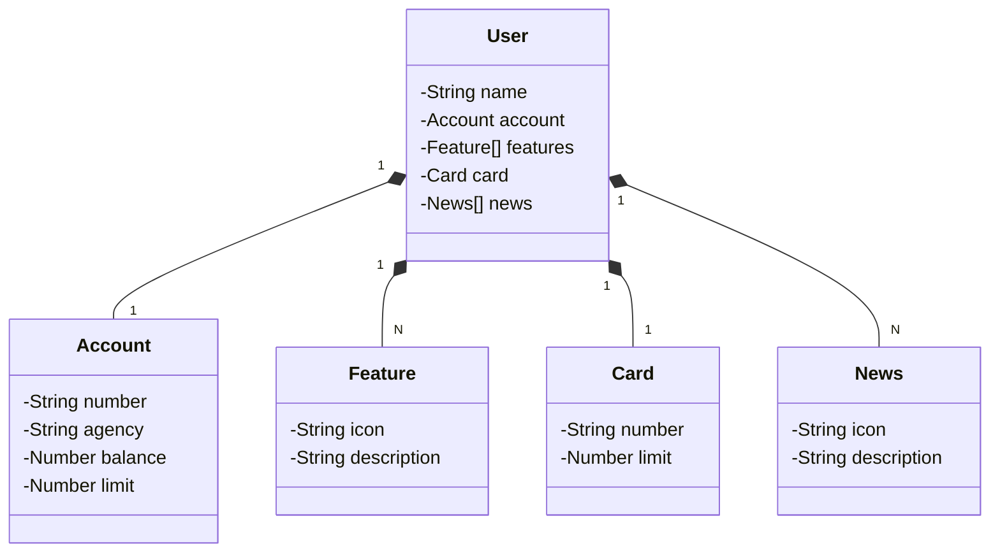

# Santander Dev 2025 - API RESTful (Réplica)

Este repositório é uma **réplica educacional** do projeto desenvolvido durante a **Santander Dev Week 2023**, disponibilizado oficialmente pela [Digital Innovation One (DIO)](https://web.digitalinnovation.one/). O objetivo é consolidar conhecimentos em desenvolvimento de APIs RESTful utilizando Java e Spring Boot, replicando as principais funcionalidades do projeto original.

---

## 🚀 Tecnologias Utilizadas

- **Java 17**  
  Versão LTS mais recente, oferecendo estabilidade e as últimas inovações da linguagem.

- **Spring Boot 3**  
  Framework que simplifica a criação de aplicações Java, com foco em produtividade e configuração mínima.

- **Spring Data JPA**  
  Facilita a implementação da camada de persistência, oferecendo integração simplificada com bancos de dados relacionais.

- **OpenAPI (Swagger)**  
  Ferramenta para documentação interativa e compreensível da API, facilitando testes e entendimento da solução.

- **Railway**  
  Plataforma que auxilia no deploy, monitoramento e gerenciamento de bancos de dados e pipelines CI/CD na nuvem.

---

## 🎨 Design e Modelagem

O design desta aplicação foi baseado no protótipo original disponibilizado no Figma, o qual serviu de referência para abstração do domínio e estruturação das entidades.

🔗 [Link para o Figma](https://www.figma.com/file/0ZsjwjsYlYd3timxqMWlbj/SANTANDER---Projeto-Web%2FMobile?type=design&node-id=1421%3A432&mode=design&t=6dPQuerScEQH0zAn-1)

---

## 📚 Diagrama de Classes - Modelo de Domínio

---

## 📌 Observação Importante

Este projeto foi criado com **finalidade educacional**, como uma **RÉPLICA** do projeto oficial desenvolvido para a **Santander Dev Week 2023** promovida pela DIO.

O repositório original, mais completo e com boas práticas adicionais (como uso de DTOs e documentação refinada), pode ser acessado aqui:

🔗 [Repositório Oficial - Santander Dev Week 2023 API (DIO)](https://github.com/digitalinnovationone/santander-dev-week-2023-api)

---

## 🎯 Objetivo

O intuito desta réplica é praticar conceitos de desenvolvimento backend com Java e Spring Boot, reforçando conhecimentos sobre:

- Estruturação de APIs RESTful
- Persistência com Spring Data JPA
- Documentação com Swagger
- Deploy simplificado com Railway

